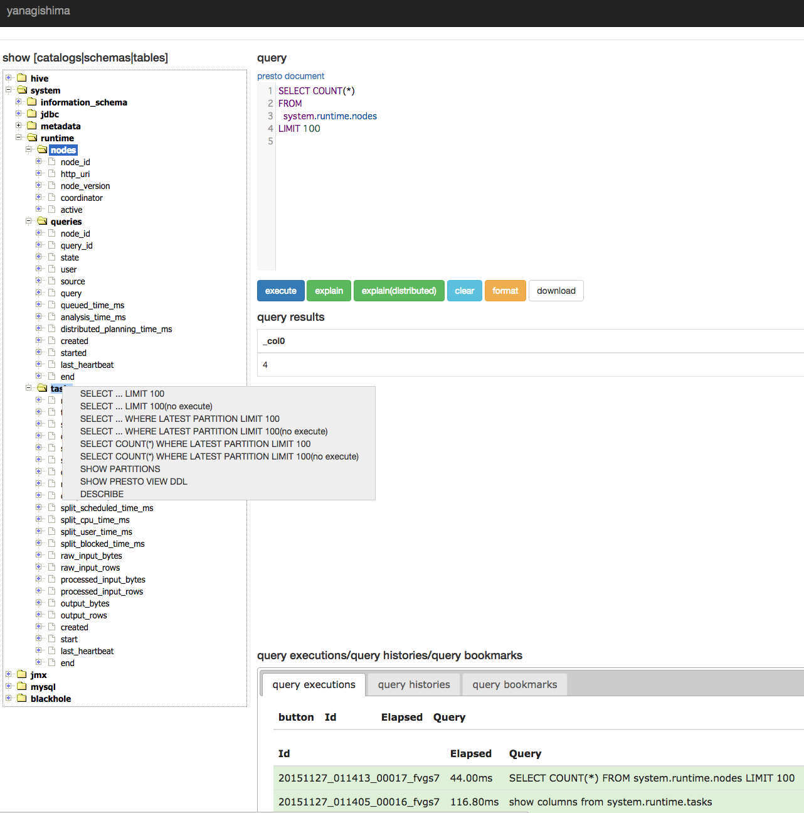

# yanagishima

yanagishima is a Web UI for presto like MySQL Workbench.



# Features
* easy to install
* easy to use like MySQL Workbench(for example, right click operation)
* query history
* query bookmark
* show query execution list
* kill running query
* format query
* show columns
* show partitions
* show query result data size
* show query result line number
* TSV download
* CSV download
* incremental search for query history
* show presto view ddl
* show ddl
* complete of query(Ctrl+Space)
* share query
* share query result
* syntax highlight
* search table
* post to HipChat

# Limitation

* paging results is not supported
* Access Control
* Authentication

# Quick Start
```
wget https://bintray.com/artifact/download/wyukawa/generic/yanagishima-1.8.zip
unzip yanagishima-1.8.zip
cd yanagishima-1.8
vim conf/yanagishima.properties
nohup bin/yanagishima-start.sh >y.log 2>&1 &
```
see http://localhost:8080/

# Configuration

You need to edit conf/yanagishima.properties.

At least, you need to edit ```presto.coordinator.server``` and ```catalog``` and ```schema```.
```
jetty.port=8080 # yanagishima web port
presto.coordinator.server=http://presto.coordinator:8080 # presto coordinator url
presto.redirect.server=http://presto.coordinator:8080 # almost same as presto coordinator url. If you use reverse proxy, specify it
select.limit=500 # if query result exceeds this limit, to show rest of result is skipped
catalog=hive # presto catalog name
schema=default # presto schema name
audit.http.header.name=some.auth.header # http header name for audit log
ikasan.url=http://ikachan.localhost/ # specify ikasan url. In detail, see https://github.com/studio3104/ikasan
ikasan.channel=#test # HipChat room name
```

# Audit Logging
yanagishima doesn't have authentication feature.
but, if you use reverse proxy server like Nginx for authentication, you can add audit logging.
In this case, please specify ```audit.http.header.name``` which is http header name to be passed through Nginx.

# Start
```
bin/yanagishima-start.sh
```

# Stop
```
bin/yanagishima-stop.sh
```

# Requirements

* Java 8

## Build yanagishima

```
./gradlew distZip
```
